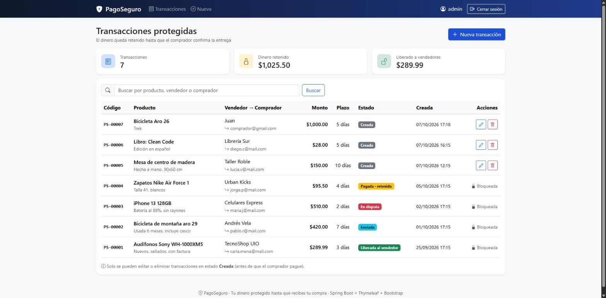
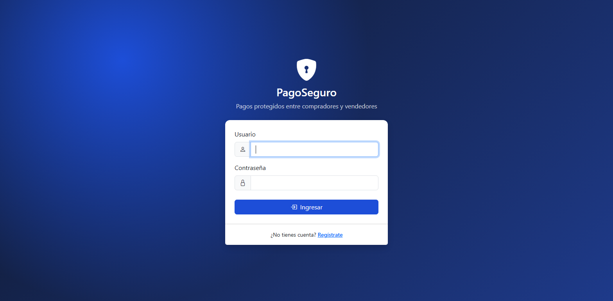
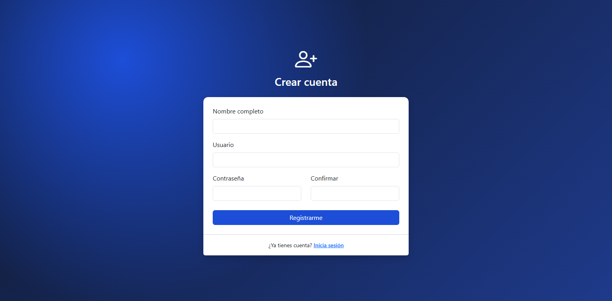
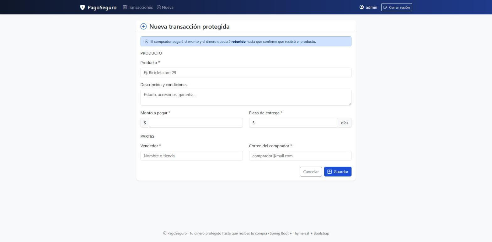

<h1 align="center">🛡️ PagoSeguro</h1>

<p align="center">
  <b>Pagos protegidos entre compradores y vendedores.</b><br>
  Tu dinero queda retenido hasta que confirmas que recibiste tu compra.
</p>

<p align="center">
  
  
  
  
  
  
  
</p>

<p align="center">
  
</p>

## 📑 Índice

- [Descripción del proyecto](#-descripción-del-proyecto)
- [Estado del proyecto](#-estado-del-proyecto)
- [Funcionalidades](#-funcionalidades)
- [Demostración](#-demostración)
- [Acceso al proyecto](#-acceso-al-proyecto)
- [Abrir y ejecutar el proyecto](#️-abrir-y-ejecutar-el-proyecto)
- [Arquitectura MVC](#-arquitectura-mvc)
- [Rutas](#-rutas)
- [Tecnologías utilizadas](#-tecnologías-utilizadas)
- [Próximos pasos](#-próximos-pasos)
- [Personas desarrolladoras](#-personas-desarrolladoras)
- [Licencia](#-licencia)

## 📝 Descripción del proyecto

Comprarle a una tienda pequeña o a un vendedor desconocido da desconfianza: ¿y si pago y nunca me llega?
**PagoSeguro** resuelve eso con un **pago protegido** (*escrow*):

1. El **vendedor** crea una transacción con el producto, el monto y el plazo de entrega.
2. El **comprador** paga, pero el dinero **queda retenido** por la plataforma.
3. El vendedor envía el producto.
4. Cuando el comprador **confirma que lo recibió**, el dinero se **libera** al vendedor. Si hay un problema, se abre una disputa.

> ⚠️ Proyecto académico: los pagos son **simulados**. En la vida real, retener dinero de terceros es una actividad
> regulada que requiere autorización.

## 🚧 Estado del proyecto

<h4 align="center">🚧 En desarrollo: proyecto del semestre de Diseño Web 🚧</h4>

Esta entrega (**Tarea 3**) incluye:

- ✅ **CRUD con el patrón MVC**: gestión de transacciones.
- ✅ **Login**: usuario y contraseña, con todas las URLs del CRUD protegidas.

## 🔨 Funcionalidades

**Autenticación (Spring Security)**
- `Login`: acceso con usuario y contraseña, con mensaje de error si son incorrectos.
- `URLs protegidas`: sin iniciar sesión, cualquier página del CRUD redirige al login.
- `Registro`: crear una cuenta nueva (usuario único, contraseña de 6 caracteres o más, confirmación).
- `Contraseñas cifradas`: se guardan con **BCrypt**, nunca en texto plano.
- `Cerrar sesión`: destruye la sesión y vuelve a exigir login.
- `Protección CSRF`: cada formulario lleva un token oculto.

**CRUD de transacciones**
- `Crear`: producto, descripción, monto ($1 – $10,000), vendedor, correo del comprador y plazo (1 – 30 días). Nace en estado **Creada** con un código como `PS-00007`.
- `Leer`: listado ordenado por fecha, con buscador por producto, vendedor o comprador.
- `Actualizar`: el mismo formulario, cargado con los datos.
- `Eliminar`: con ventana de confirmación.
- `Resumen`: total de transacciones, **dinero retenido** y dinero **liberado** a vendedores.
- `Regla de negocio`: solo se puede editar o eliminar una transacción en estado **Creada**. Si ya hay dinero de por medio, aparece como 🔒 *Bloqueada* y el servidor rechaza cualquier cambio.
- `Validaciones en el servidor`: los errores se muestran en rojo bajo cada campo.

**Estados del dinero:** `Creada → Pagada (retenida) → Enviada → Liberada`, y desde `Enviada → En disputa → Reembolsada / Liberada`, además de `Cancelada`.

## 🎥 Demostración

📹 **Video:** _[agregar aquí el enlace de Loom o YouTube]_

| Login | Registro |
|:---:|:---:|
|  |  |

| Listado de transacciones | Nueva transacción |
|:---:|:---:|
|  |  |

## 📁 Acceso al proyecto

```bash
git clone <URL-DEL-REPOSITORIO>
cd Tare3_CrudLogin
```

## 🛠️ Abrir y ejecutar el proyecto

**Requisito:** JDK 17 o superior. No hace falta instalar Maven, porque el proyecto incluye el *Maven Wrapper*.

```bash
# PowerShell / CMD
.\mvnw.cmd spring-boot:run

# Git Bash / Linux / Mac
./mvnw spring-boot:run
```

Luego abre **http://localhost:8080**. Te redirige al login.

| Usuario | Contraseña |
|:---:|:---:|
| `admin` | `admin123` |

- La base de datos **H2** se crea sola en `./data/pagoseguro.mv.db`, con 6 transacciones de ejemplo y el usuario admin.
- Consola de la BD (requiere login): http://localhost:8080/h2-console. JDBC URL `jdbc:h2:file:./data/pagoseguro`, usuario `sa`, sin contraseña.
- Si no ves los cambios de estilos, presiona `Ctrl + Shift + R`.

## 🧩 Arquitectura MVC

```
src/main/java/com/pagoseguro/
├── model/          → M: entidades JPA (Transaccion, Usuario) y el enum EstadoTransaccion
├── repository/     → acceso a datos con Spring Data JPA
├── dto/            → datos de formularios que no son tablas (RegistroForm)
├── service/        → lógica de negocio (TransaccionService, UsuarioService)
├── controller/     → C: reciben la petición, llaman al servicio y eligen la vista
└── config/         → seguridad (SecurityConfig) y datos iniciales (DataInitializer)
src/main/resources/
├── templates/      → V: vistas Thymeleaf + Bootstrap (transacciones/, auth/, fragments/)
└── static/css/     → estilos propios
```

**Flujo:** `Navegador → Spring Security → Controller → Service → Repository → BD`, y de vuelta `Controller → Vista Thymeleaf → HTML`.

## 🔗 Rutas

| Método | URL | Acción | Acceso |
|---|---|---|:---:|
| GET / POST | `/login` | Iniciar sesión | Público |
| GET / POST | `/registro` | Crear cuenta | Público |
| POST | `/logout` | Cerrar sesión | 🔒 |
| GET | `/transacciones?q=` | **R**ead: listar y buscar | 🔒 |
| GET | `/transacciones/nueva` | **C**reate: formulario vacío | 🔒 |
| GET | `/transacciones/editar/{id}` | **U**pdate: formulario con datos | 🔒 |
| POST | `/transacciones/guardar` | Guardar (crea si no hay id, actualiza si hay id) | 🔒 |
| POST | `/transacciones/eliminar/{id}` | **D**elete | 🔒 |

## 💻 Tecnologías utilizadas

- **Java 17**
- **Spring Boot 4.1**: Spring MVC, Spring Data JPA, Bean Validation
- **Spring Security 7**: login, BCrypt y CSRF
- **Thymeleaf** + `thymeleaf-extras-springsecurity6`
- **Bootstrap 5.3** + Bootstrap Icons
- **H2 Database**, guardada en archivo
- **Maven Wrapper**

## 🔭 Próximos pasos

- [ ] Roles: comprador, vendedor y administrador
- [ ] Pago simulado: el dinero pasa a **retenido**
- [ ] Envío con número de guía y confirmación de recepción
- [ ] Disputas: el comprador reclama y el administrador decide si reembolsar o liberar el dinero
- [ ] **Núcleo:** comisión de la plataforma por tramos y liquidación a cada vendedor según un rango de fechas

## 👥 Personas desarrolladoras

- **Juan Choca**
- **Estefano Lopez**

## 📄 Licencia

Proyecto académico, desarrollado para la materia de **Diseño Web**. Sin licencia de uso comercial.
